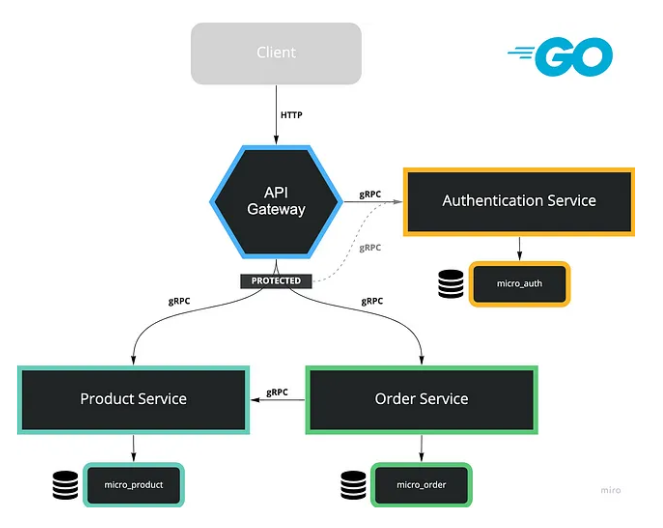
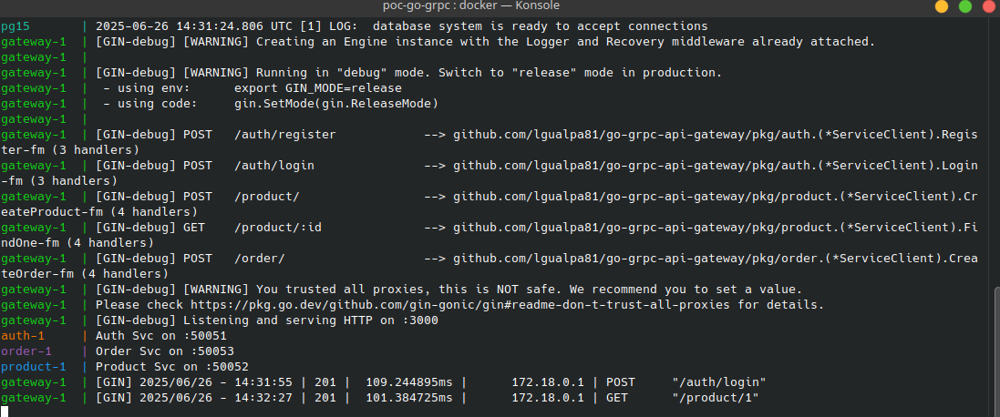

## Microservices in Go with gRPC

We will develop 3 Microservices and 1 API Gateway which handles incoming HTTP requests.

HTTP requests will be forwarded to these Microservices by gRPC. Additionally, we deal with JWT authentication.

### Application Infrastructure

<p align="center">
  
</p>

- `API Gateway`: Handles incoming HTTP requests
- `Auth Service`: Provides features such as Register, Login and generates Token by JWT
- `Product Service`: Provides features such as Add Product, Decrease Stock and Find Product
- `Order Service`: The only feature we ship in this Microservice is Create Order

Each Microservice will be a standalone project.

### Installing modules

- Go Version Management: goenv

```bash
https://github.com/go-nv/goenv

goenv install 1.24.1
goenv global 1.24.1
```

- Protobuf

```bash
apt install -y protobuf-compiler
go install google.golang.org/protobuf/cmd/protoc-gen-go@latest
go install google.golang.org/grpc/cmd/protoc-gen-go-grpc@latest
```

- Dependencies for each microservice

```bash
# api-gateway
$ go get github.com/gin-gonic/gin
$ go get github.com/spf13/viper
$ go get google.golang.org/grpc

#auth-svc
$ go get github.com/spf13/viper
$ go get google.golang.org/grpc
$ go get gorm.io/gorm
$ go get gorm.io/driver/postgres
$ go get golang.org/x/crypto/bcrypt
$ go get github.com/golang-jwt/jwt

#product-svc
$ go get github.com/spf13/viper
$ go get google.golang.org/grpc
$ go get gorm.io/gorm
$ go get gorm.io/driver/postgres

#order-svc
$ go get github.com/spf13/viper
$ go get google.golang.org/grpc
$ go get gorm.io/gorm
$ go get gorm.io/driver/postgres
```

### Build and testing

```bash
# copy env configurations
cp .env.example .env

# Start application
docker compose up -d
```

<p align="center">
  
</p>

You can test each endpoint with software such as Insomnia, Postman or simply using cURL.

- Register a new User

First, we need to create a user.

```bash
curl -X POST --location 'http://localhost:3000/auth/login' \
-H 'Content-Type: application/json' \
--data '{
    "email":"joedoe@demo.com",
    "password":"12345678"
}'
```

- Login

Second, we need to login, in order to receive the JSON Web Token.

```bash
curl -X POST \
  --url http://localhost:3000/auth/login \
  -H 'Content-Type: application/json' \
  --data '{
 "email": "joedoe@demo.com",
 "password": "12345678"
}'

```

The response is important because we need for further requests the response token.

Response

```bash
{
    "status": 200,
    "token": "<YOUR_JWT_TOKEN>"
}
```

- Create Product

Now, we need to add the token to the request header to create a product.

```bash
$ curl -X POST \
  --url http://localhost:3000/product \
  -H 'Authorization: Bearer <YOUR_JWT_TOKEN>' \
  -H 'Content-Type: application/json' \
  --data '{
 "name": "Keyboard",
 "stock": 5,
 "price": 15.99
}'

```

- Find One Product

To find a product, we need to add the product’s ID at the URL.

```bash
curl --request GET \
  --url http://localhost:3000/product/1 \
  -H 'Authorization: Bearer <YOUR_JWT_TOKEN>'
```

- Create Order

To create an order, we need to add the Product ID and the quantity.

```bash
curl -X POST \
  --url http://localhost:3000/order \
  -H 'Authorization: Bearer <YOUR_JWT_TOKEN>' \
  -H 'Content-Type: application/json' \
  --data '{
 "productId": 1,
 "quantity": 1
}'
```

### Links

- [gRPC](https://grpc.io/docs/languages/go/quickstart/#regenerate-grpc-code)
- [Protocol Buffers](https://protobuf.dev/getting-started/gotutorial/)
